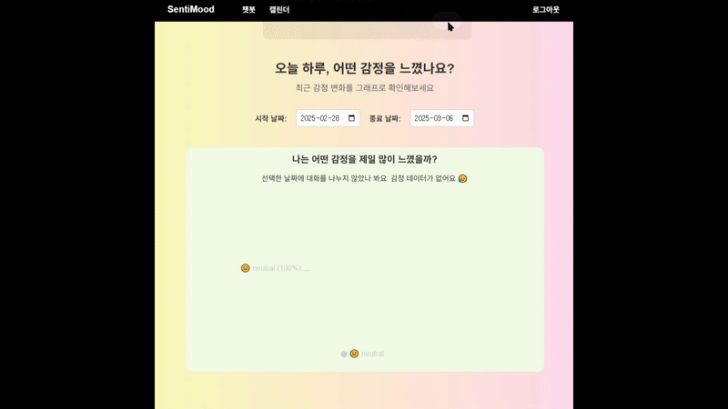
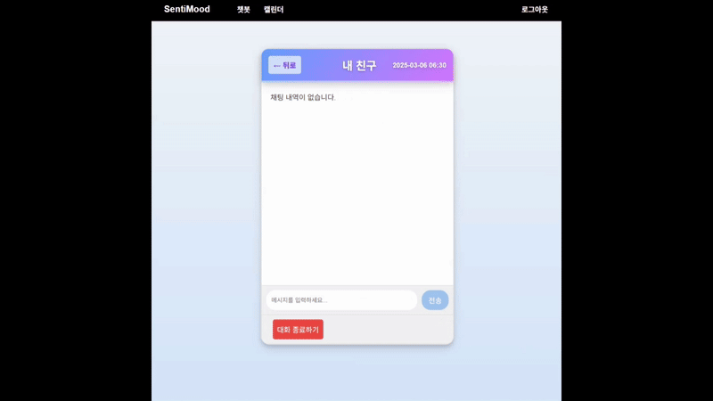
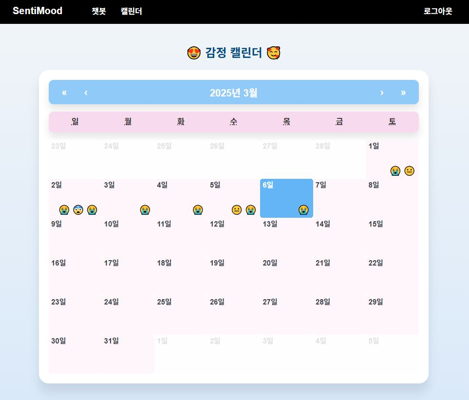
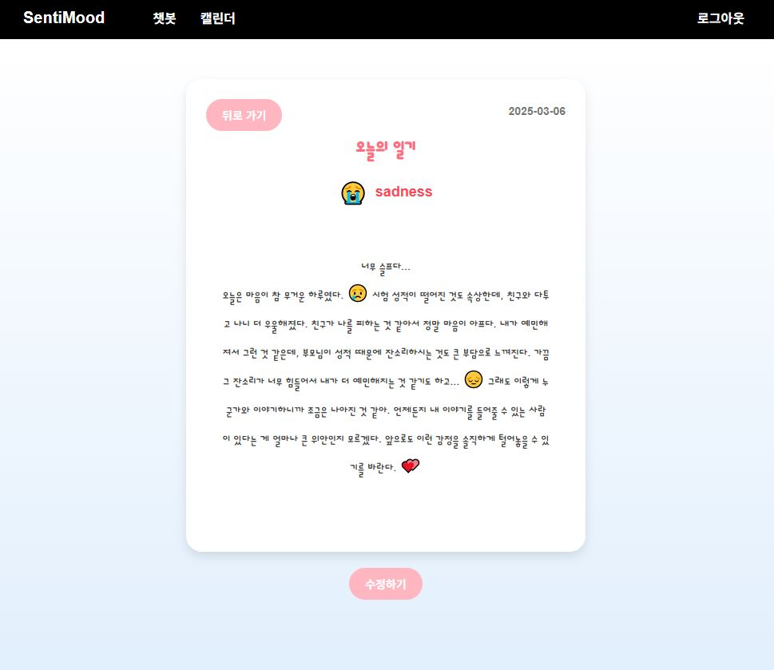
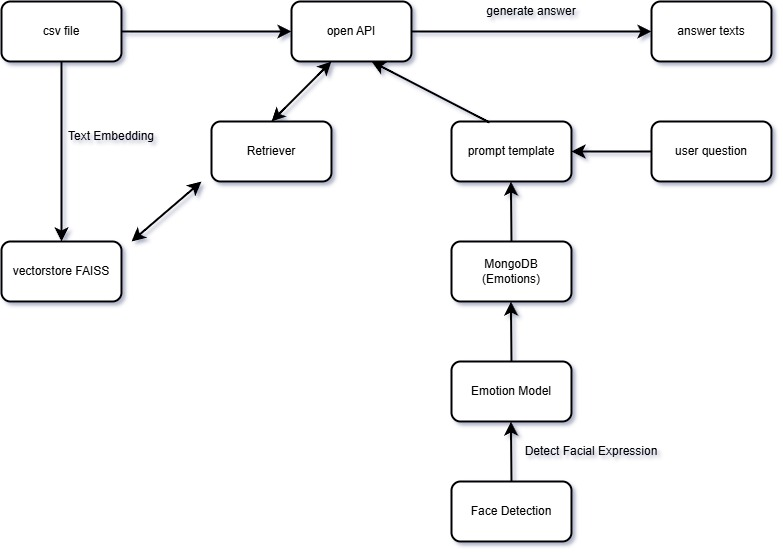
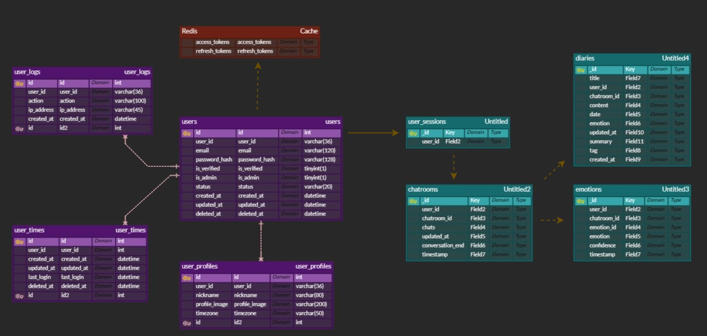

# SentiMood

사용자의 얼굴을 인식하여 감정을 분석하고 맞춤형 상담을 제공하는 청소년들을 위한 AI 상담 챗봇.  
대화 내용과 감정을 저장하여 감정 캘린더에서 변화 추이를 확인할 수 있으며,대화 종료 후 자동으로 생성되는 요약을 기반으로 일기 기능 제공.

### 주요 기능
- **실시간 감정 분석**  
  - 웹캠을 통해 사용자의 감정을 분석하여 감정 상태를 인식  
  - 감정 분석 결과를 바탕으로 맞춤형 챗봇 상담 제공  

- **맞춤형 챗봇 상담**  
  - 사용자의 감정을 기반으로 상황에 맞는 대화를 제공  
  - FAISS + RAG(검색 증강 생성)를 활용하여 대화 품질 개선  

- **감정 캘린더**  
  - 감정을 추적하여 시각적으로 표시  
  - 감정 변화를 한눈에 볼 수 있도록 캘린더 형식으로 제공  

- **대화 요약 및 일기 기능**  
  - 대화가 종료되면 자동으로 요약하여 일기로 저장     

#### 감정 통계 그래프 (홈 화면)


#### 챗봇 상담 화면


#### 감정 캘린더


#### 일기장
  

### Model Architecture


### ERD


### 기술스택
백엔드	:  Flask (JWT, bcrypt, Swagger)  
프론트엔드	:  React.js (Zustand, Axios, Styled Components)  
데이터베이스  :  MySQL, MongoDB, Redis, FAISS (벡터 DB)  
AI 모델	 :  EfficientNet B2 (얼굴 감정 분석 모델), FAISS + RAG (챗봇 검색)  
웹캠 및 이미지 처리  :  react-webcam, OpenCV  

### 백엔드 설명
[백엔드 폴더구조 및 설치 README](./be/README.md)

### 프론트엔드 설명
[프론트엔드 폴더구조 및 설치README](./fe/README.md)

### 전체 폴더구조
```
📦 SentiMood
├── 📂 data
│   ├── 📂 raw
│   ├── 📂 db 
│   │    └── 📂 faiss_v2 # 벡터db
│   └── 📂 models  # 모델 저장
├── 📂 be
├── 📂 fe
├── 📂 test
├── 📂 notebook
├── 📂 models
│   ├──📂 llm
│   │   ├── 📄 01_jsonl_to_csv.ipynb  # JSONL 데이터를 CSV로 변환
│   │   ├── 📄 02_save_vector_db_v2.ipynb  # 벡터DB로 변환하여 저장
│   │   ├── 📄 03_evaluate_vector_db.ipynb  # rag 성능 평가
│   │   └── 📄 04_rag_chatbot_v2.ipynb  # RAG 챗봇 구현 코드
    └──📂 face
│       ├── 📄 preprocess.py  # 데이터를 전처리
│       ├── 📄 TEST_1efficientnet_b2_model.keras  # 감정분류 모델
│       ├── 📄 train_model.py  # 감정분류 모델을 훈련시켰던 코드
│       └── 📄 test_model.py  # 훈련이 완료된 모델을 테스트하고 MongoDB에 전달하는 코드
├── 📄 .env  
├── 📄 .gitattributes  # Git 속성 설정
├── 📄 .gitignore  
├── 📄 README.md  
└── 📄 requirements.txt  # 프로젝트 의존성 패키지 목록


```

### 실행 방법
1. git clone
2. 가상환경 실행
3. 라이브러리 설치
```bash
pip install -r requirements.txt
```

### .env
- 아래 내용 기입하여 별도 생성 필요
```bash
OPENAI_API_KEY=
```